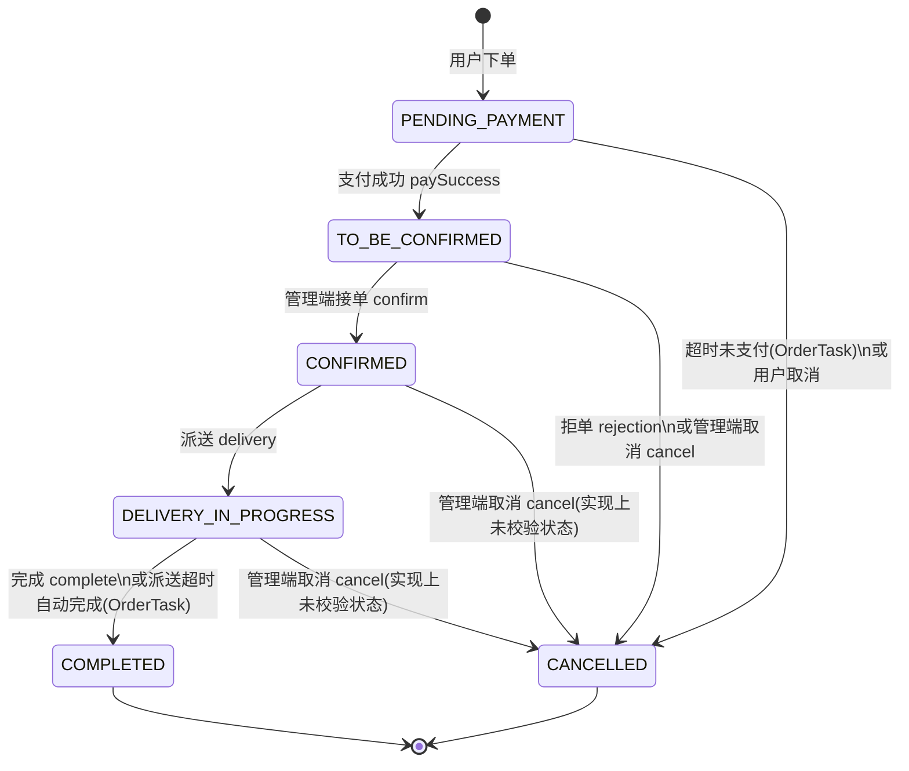

# M5 — 管理端订单 + 定时任务 — 测试用例设计（SCRUM-232）

> 依据：`测试人员分工.md`（状态迁移图 + 场景法）、`Jira项目管理SOP.md`（ORD 前缀、Given-When-Then）  
> 对照代码：`sky-take-out-main` 中 `OrderController`(admin)、`OrderServiceImpl`、`OrderMapper`/`OrderMapper.xml`、`OrderTask`、`WebSocketTask`  
> 用途：粘贴到 Jira **SCRUM-232** 描述区，或拆成多条子 Task（Epic `TEST-UNIT`）

---

## 1. 订单状态与业务含义

| 常量 | 值 | 含义 |
|------|---:|------|
| `PENDING_PAYMENT` | 1 | 待付款 |
| `TO_BE_CONFIRMED` | 2 | 待接单 |
| `CONFIRMED` | 3 | 已接单 |
| `DELIVERY_IN_PROGRESS` | 4 | 派送中 |
| `COMPLETED` | 5 | 已完成 |
| `CANCELLED` | 6 | 已取消 |

支付状态：`UN_PAID=0`，`PAID=1`，`REFUND=2`。

---

## 2. 状态迁移图（管理端主路径 + 合法操作）

下列为**理想业务语义**；与 `OrderServiceImpl` 实际校验是否一致见第 4 节「非法状态」用例（代码对部分接口**未做前置状态校验**，单测应写清**当前实现行为**与**期望业务**）。



---

## 3. 管理端接口清单（与 Controller 一致）

| 方法 | 路径 | 说明 |
|------|------|------|
| GET | `/admin/order/conditionSearch` | 条件分页查询 |
| GET | `/admin/order/statistics` | 待接单/待派送/派送中数量 |
| GET | `/admin/order/details/{id}` | 订单详情（含明细） |
| PUT | `/admin/order/confirm` | 接单 |
| PUT | `/admin/order/rejection` | 拒单 |
| PUT | `/admin/order/cancel` | 取消订单 |
| PUT | `/admin/order/delivery/{id}` | 派送 |
| PUT | `/admin/order/complete/{id}` | 完成 |

> 分工表写「7 个接口」时，通常未计入 `statistics`；**单测建议 8 个接口全覆盖**（含统计）。

---

## 4. 场景法 — 端到端业务场景（集成/W3 可复用）

| 场景编号 | 场景名称 | 主要步骤 | 预期 |
|----------|----------|----------|------|
| S-ORD-01 | 正常履约链 | 待接单 → 接单 → 派送 → 完成 | 状态依次为 2→3→4→5；库表与接口一致 |
| S-ORD-02 | 拒单闭环 | 待接单 + 已支付 → 拒单（填原因） | 状态 6；`rejection_reason` 入库；已支付会走退款调用 |
| S-ORD-03 | 管理端取消 | 待接单/已接单等 → cancel（原因） | 状态 6；已支付分支调用退款（`payStatus==1`） |
| S-ORD-04 | 超时未支付 | 插入待付款且 `order_time` 早于阈值 → 触发 `OrderTask.processTimeoutOrder` | 状态 6，`cancel_reason` 含「超时未支付」 |
| S-ORD-05 | 派送超时自动完成 | 派送中且下单时间早于阈值 → `processDeliveryOrder` | 状态 5（实现里同时写入取消相关字段，单测以代码为准） |
| S-ORD-06 | 条件查询组合 | 仅 number / 仅 phone / 仅 status / 时间区间 / 多条件组合 | SQL 动态 `where` 正确，`order by order_time desc` |

---

## 5. 详细用例表（Jira Task 建议一条一行）

### 5.1 Controller — MockMvc（单元）

| 编号 | Summary（可复制到 Jira） | 测试方法要点 |
|------|--------------------------|--------------|
| ORD-101 | 单元: GET conditionSearch 无额外条件返回分页与 total | Mock Service 返回 `PageResult`，校验 JSON 结构 |
| ORD-102 | 单元: GET conditionSearch 带 number/phone/status/时间 参数透传 | 校验 `orderService.conditionSearch` 被调用且 DTO 字段一致 |
| ORD-103 | 单元: GET statistics 返回待接单/待派送/派送中数量 | Mock `OrderStatisticsVO` 三字段 |
| ORD-104 | 单元: GET details/{id} 返回 OrderVO | Mock `details(id)` |
| ORD-105 | 单元: PUT confirm 成功 | Body `OrdersConfirmDTO`，Mock `confirm` |
| ORD-106 | 单元: PUT rejection 成功 | Mock `rejection` |
| ORD-107 | 单元: PUT cancel 成功 | Mock `cancel` |
| ORD-108 | 单元: PUT delivery/{id} 成功 | Mock `delivery` |
| ORD-109 | 单元: PUT complete/{id} 成功 | Mock `complete` |

#### ORD-104 描述模板（示例）

```
【测试目标】管理端订单详情接口返回封装后的 OrderVO

【Given】orderService.details(100) 返回含 orderDetailList 的 OrderVO
【When】GET /admin/order/details/100（Header 带合法 admin Token，若拦截器开启）
【Then】HTTP 200；Result.data 中含订单字段与明细列表

【测试方法】场景法 — 主路径
【所属模块】管理端订单
```

---

### 5.2 Service — Mock OrderMapper / WeChatPayUtil（单元）

| 编号 | Summary | 行为说明（对照源码） |
|------|-----------|----------------------|
| ORD-201 | 单元: confirm 将订单更新为已接单(3) | `confirm` 仅 `update` 为 CONFIRMED，**未校验当前状态** |
| ORD-202 | 单元: rejection 待接单且已支付时调退款并取消 | `TO_BE_CONFIRMED` + `PAID` → `refund` + 状态 6 |
| ORD-203 | 单元: rejection 订单不存在抛 OrderBusinessException | `getById` 返回 null |
| ORD-204 | 单元: rejection 非待接单状态抛订单状态错误 | status ≠ 2 |
| ORD-205 | 单元: delivery 非已接单抛订单状态错误 | status ≠ 3 |
| ORD-206 | 单元: complete 非派送中抛订单状态错误 | status ≠ 4 |
| ORD-207 | 单元: delivery 订单不存在抛订单状态错误 | 与上同属 ORDER_STATUS_ERROR |
| ORD-208 | 单元: cancel 已支付 payStatus=1 时调用退款并取消 | 注意代码用字面量 `1` 与 `Orders.PAID` 一致 |
| ORD-209 | 单元: cancel 未支付直接取消 | 无 refund 调用 |
| ORD-210 | 单元: statistics 三次 countStatus 封装 VO | Mock `countStatus` 返回值 |

**非法状态扩展（与分工「已完成再派送应拦截」对齐）**：

| 编号 | Summary | 当前实现预期（写单测时核实） |
|------|-----------|------------------------------|
| ORD-211 | 单元: confirm 在已完成订单上仍执行 update | 代码无 if：**会更新库**，属业务缺口或刻意简化 —— 单测断言「当前行为」并可在报告写改进建议 |
| ORD-212 | 单元: complete 在已完成状态再次调用 | 抛 `ORDER_STATUS_ERROR` |
| ORD-213 | 单元: delivery 在待接单状态调用 | 抛 `ORDER_STATUS_ERROR` |

#### ORD-204 描述模板

```
【测试目标】拒单仅允许「待接单」状态

【Given】orderMapper.getById(1) 返回 status=3 的订单
【When】调用 orderService.rejection(dto) 且 dto.id=1
【Then】抛出 OrderBusinessException，msg 含「订单状态错误」

【测试方法】状态迁移 — 非法迁移
【所属模块】管理端订单
```

---

### 5.3 Mapper — @MybatisTest + H2（单元）

| 编号 | Summary | SQL/方法 |
|------|-----------|----------|
| ORD-301 | 单元: pageQuery 仅 number 模糊 | `number like %x%` |
| ORD-302 | 单元: pageQuery 仅 phone 模糊 | `phone like %x%` |
| ORD-303 | 单元: pageQuery 仅 status 精确 | `status = ?` |
| ORD-304 | 单元: pageQuery beginTime/endTime 闭区间 | `order_time >=` 且 `<=` |
| ORD-305 | 单元: pageQuery number+status+时间 组合 | 多条件同时生效 |
| ORD-306 | 单元: pageQuery 无条件返回全部按 order_time desc | 动态 where 全不拼 |
| ORD-307 | 单元: getByStatusAndOrderTimeLT 待付款超时列表 | 供 OrderTask 使用 |
| ORD-308 | 单元: countStatus 按状态计数 | statistics 依赖 |

> `update` 动态 `<set>` 可另设 ORD-309：仅更新 status、仅更新 cancel_reason 等片段更新。

---

### 5.4 定时任务 OrderTask（单元）

| 编号 | Summary | 要点 |
|------|-----------|------|
| ORD-401 | 单元: processTimeoutOrder 无超时订单不调用 update | `getByStatusAndOrderTimeLT` 返回空 |
| ORD-402 | 单元: processTimeoutOrder 有待付款超时订单批量取消 | 状态 6 + cancelReason + cancelTime |
| ORD-403 | 单元: processDeliveryOrder 无符合条件订单 | 空列表 |
| ORD-404 | 单元: processDeliveryOrder 派送中超时变已完成 | 状态 5，观察实现中对 cancelReason/cancelTime 的赋值 |

> Cron 表达式仅文档说明；单测直接调用方法 + Mock `OrderMapper`。

---

### 5.5 WebSocketTask（单元）

| 编号 | Summary | 要点 |
|------|-----------|------|
| ORD-501 | 单元: sendMessageToClient 调用 webSocketServer.sendToAllClient | Mock `WebSocketServer`，断言消息前缀与时间格式存在 |

---

## 6. 与 SCRUM-229～231 的映射

| Jira 子任务 | 建议覆盖用例编号 |
|-------------|------------------|
| Controller 层 | ORD-101～ORD-109 |
| Service 层 | ORD-201～ORD-213 |
| Mapper 层 | ORD-301～ORD-309（按需） |
| 设计用例（本文） | 全表 + 状态图 + 场景 S-ORD-01～06 |

---

## 7. W3「测试方法对比」备忘

| 设计方法 | 可用于对比的用例示例 |
|----------|----------------------|
| 状态迁移图 | ORD-202、ORD-204～207、ORD-211～213 |
| 场景法 | S-ORD-01～S-ORD-03、S-ORD-06 |

---

## 8. 提交 Jira SCRUM-232 时可粘贴的简短说明

```
已完成 M5 测试用例设计：
- 订单状态迁移图（Mermaid）与 6 个场景法主场景
- 管理端 8 个 REST 接口与 Service/Mapper/OrderTask/WebSocketTask 用例编号 ORD-1xx～5xx
- 标注了 confirm/cancel 与状态校验相关的实现特点，便于编写单测断言

详细见仓库文件：M5_管理端订单与定时任务_设计用例.md
```

完成编码阶段后，将 SCRUM-232 拖至 **Review**，Comment 中附上本文路径或节选即可。
